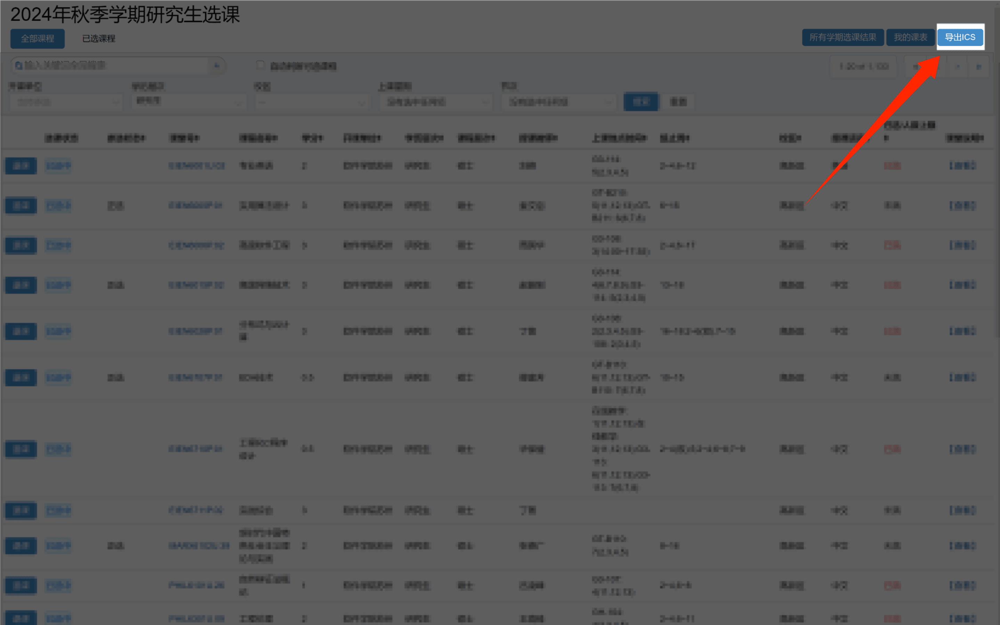

# USTC Courses to ICS
USUSTC Courses to ICS是一个用于将中国科学技术大学课程表导出为ICS文件的油猴脚本，以便将课程信息导入到日历应用中。

## 使用方法
1. [安装本插件](https://greasyfork.org/zh-CN/scripts/511981-ustc-courses-to-ics)并启用。
2. 打开[教务系统](https://jw.ustc.edu.cn/)并进入选课页面。
3. 通过右上角导出ICS按钮下载ICS。

